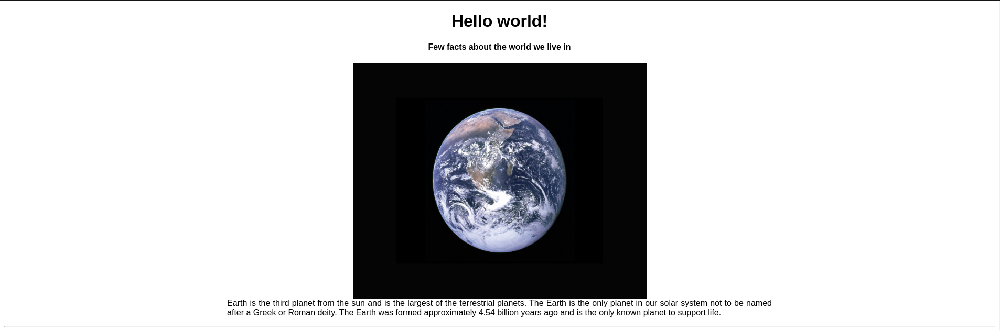

<<<<<<< HEAD
# Mother-Earth-Website
Welcome to Mother Earth Website - Interactive Webpage repository!  This project showcases a simple yet interactive webpage that provides intriguing facts about Earth. Designed with a clean and readable layout, it includes visuals and multimedia elements to enhance the user experience.

## Project Overview
This project involves creating an interactive webpage that provides information about Earth, some interesting facts, and a visual representation through images and videos. The webpage is styled with CSS and structured using HTML.




## Project Structure
my_website/ ├── index_earth.html ├── css/ │ └── styles.css ├── images/ │ └── earth.jpg └── README.md

## Features 
- **Main Heading**: Welcomes users with "Hello world!"
- **Subheading**: Introduces some facts about the world we live in.
- **Image**: Displays an image of Earth.
- **Informative Paragraphs**: Provides detailed information about Earth, justified and centered.
- **Facts about Mother Earth**: Lists important facts in an unordered list.
- **YouTube Video**: Embeds a video related to Earth.
- **Top Facts**: Lists the top 3 facts about Earth in an ordered list.
- **Temperature Table**: Displays a table comparing the average temperatures of Mars and Venus.
- **External Link**: Provides a link for more information about space.

# Usage 
1. **Clone the Repository**: ```bash git clone https://github.com/Shrihith-a/Mother-Earth-Website.git ```
2. **Navigate to the Project Directory**: ```bash cd my_website ```
3. **Open index.html in Your Browser**: - Simply open the `index.html` file in any web browser to view the interactive webpage.
   
## Technologies Used 
- **HTML**: For structuring the webpage.
- **CSS**: For styling the webpage elements and ensuring the content is centered and justified.
=======
# Tutedude Projects
Welcome to My Tutedude Projects Repository! 👋 This repository showcases all the projects I've created as part of my Tutedude courses. Each project demonstrates my dedication, hard work, and passion for continuous learning in various technology areas. Dive in and explore my journey of skill enhancement and knowledge growth! 🚀

🌟 **Highlights:**
-**Comprehensive Projects:** Covering various aspects of web development, data science, and more.
- **Hands-on Experience:** Gained with cutting-edge technologies and real-world applications.
- **Detailed Documentation:** Each project includes clear documentation and code comments for better understanding.
- **Continuous Updates:** Regularly adding new projects as I progress through the courses.

  
>>>>>>> origin/main
